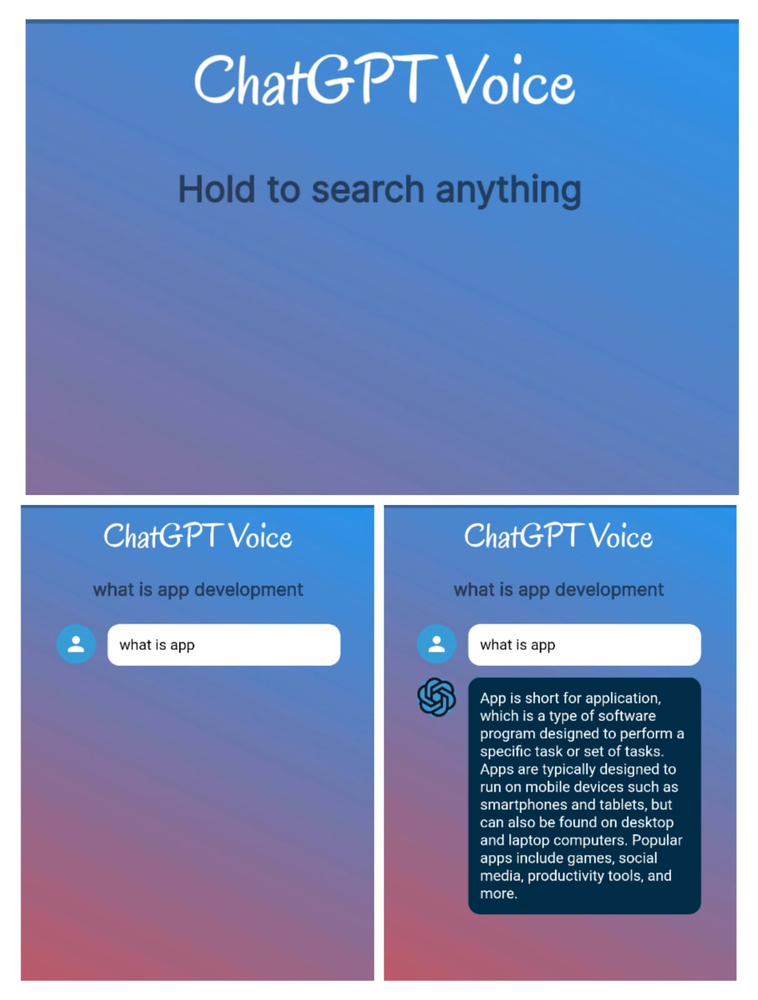
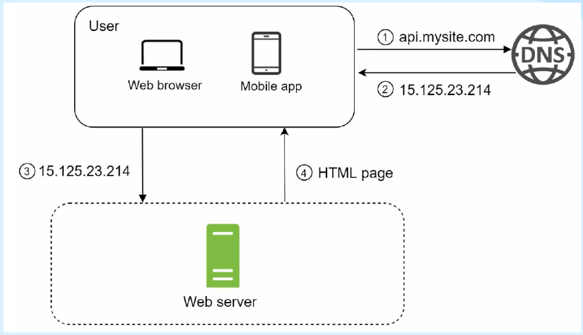

### Hey Folks!!

### Welcome to TechVistara 2.0

TECHVISTARA focuses on giving a brief about trending tech domains like Web development , App development ,Ethical hacking,
Data Structures and Algorithms, System Design and other important topics like personal branding and laptop guide .
There will be a session on each topic followed by a quiz . the winners of the quiz will be awarded with cool swags. 
So don’t miss out – come join us on January 13 at New Auditorium to experience a orientation.

#### Register for the event [Here](https://forms.gle/QNpSPppBs5NVr3YY8)

## TECHVISTARA 2.0 - TECH_IT_OUT

### Agenda

- Session followed by quiz on Web Development 
- Session followed by quiz on App development 
- Session followed by quiz on Data structures and Algorithms
- Session followed by quiz on Laptop Guide 
- Session followed by quiz on Ethical Hacking
- Session followed by quiz on Personal Branding
- Session followed by quiz on System Design
- Online Quiz to be conducted.
- Any announcements, feedback, QnA.

## Event Details

This event aims to give the audiences a brief idea about all the popular domains trending now a days. 

- **Date**:13th January 2023.
- **Time**:12:30 - 3:50 PM

## Speakers:

- **Apoorv Kumar** 
- **Vishal Sinha** 
- **Ankit josh** 
- **Ayush Rathore** 
- **Mehul Jaiswal** 
- **Kushagra Agarwal** 
- **Shreya Raj** 

## The event was held as follows:

Event takes of as the orators introduced the audience to the teacher coordinators , introduced audience to the community.
Brief of speaker and domains were given the orator .

# Web Development

**Speaker: Apoorv Kumar**

## About Web development 

Web development is the process of designing, building, and maintaining websites. It involves a combination of front-end and back-end development to create dynamic and interactive web pages. Front-end development focuses on the visual and user-facing aspects of a website using technologies such as HTML, CSS, and JavaScript. Back-end development, on the other hand, involves server-side scripting and database management to power the functionalities of a website. Web development is crucial in today's digital age as a majority of businesses and individuals have a web presence to reach and engage with a wider audience

## Talk Included

- ### Front End Web development
- ### Version Control System 
- ### Back End Web Development
- ### Why do we need a community

## Salary of a Web Developer 

The average salary of a web developer in India is around ₹5-7 lakhs per year, with top earners making over ₹10-12 lakhs. In the United States, the average salary for a web developer is around $75,000 per year, with top earners making over $120,000. The salary range for web developers varies based on experience, skills, location, and company size. Both India and the US have a high demand for skilled web development professionals, making it a lucrative career option. The web development industry is constantly growing and evolving, offering opportunities for growth and advancement for web developers.

**"Apoorv Kumar"**

# App Development

**Speaker : Vishal Sinha**

  Speaker stars of by giving a brief about himself and his achievements .

## Why App Development ?

  - High demand
  - Career opportunity
  - Start-up Potential 
  - Flexibility 
  - Constant Learning 

## Platforms 

   - Native - Specific for a particular operating system like Android or Ios .
   - Cross Platform - Used to create App for more that one operating system with a single codebase .

## Native 
- Native app development is the process of building apps specifically for a particular operating system (OS), such as iOS or Android.
- Native apps are built using programming languages specific to the OS, such as Swift for iOS and Java for Android.
- Native apps are faster and more reliable than cross-platform apps, as they can take full advantage of the device's hardware and software capabilities.
- Native apps can be sold through app stores, and have the ability to receive updates and push notifications.

## Cross-Platform

- Cross-platform app development involves building an app that can run on multiple operating systems, such as iOS and Android.
- Cross-platform apps are built using technologies such as React Native, Xamarin, or Flutter, which allow for code reuse across different platforms.
- This can result in faster development times and lower costs compared to native app development.
- Cross-platform apps also have the advantage of reaching a wider audience, as they can be released on multiple app stores.
- However, cross-platform apps may not have the same performance or access to device features as native apps, and may not provide as seamless of an experience.

## Facts

- As of January 2021, Android is the most popular mobile operating system in the world, with a market share of over 80%.
- Android has a large user base, with over 2.5 billion active devices as of September 2020.
iOS has a market share of around 15-20% in the global smartphone market
- Android apps can be developed on macOS, Windows, and Linux, using various integrated development environment (IDE) such as Android Studio.
- iOS apps are developed using Xcode, which is only available on macOS.

## How to start ?
 - Documentation 
 - Boot Camps 
 - Online Course
 - Self Implementation

## ChatGpt voice App 

### Speaker demonstrated the application to audience 

**"Vishal Sinha"**

# Competitive programming and DSA

**Speaker : Ankit Josh**

Speaker starts of by introducing himself to the audience .

## What is programming ?

Programming is the process of designing, writing, testing, debugging, and maintaining the source code of computer software. It involves using programming languages, such as Python, Java, C++, to write instructions that tell a computer what to do. These instructions, also known as code, are executed by the computer to perform specific tasks. Programming is a fundamental aspect of computer science and enables individuals to create software applications, websites, and other types of computer programs. It requires a combination of logical thinking, creativity, and problem-solving skills. By learning how to program, individuals can develop their ability to think computationally and create innovative solutions to real-world problems.

## Programming Languages

We communicate with computers with help of programming languages. These are languages that the computer understands.

Here are a few popular ones:
- C++
- Java
- Python
- JavaScript

## What is DSA?

- DSA stands for “Data Structures and Algorithms”.

- It is a branch of Computer Science that deals with creating machine-efficient computer programs.

- “Data Structure” refers to storage of data and “Algorithm” is the procedure to solve a problem.

- By combining both “Data Structures” and “Algorithms”, we optimize the codes in Software       Engineering.

## Why do DSA?

- It is the fundamentals of Computer Science ✅

- It will help you in cracking interviews at MAANG 🤑

- Helps stand out your resume 🔥

- It will help you while doing projects 🤘

- It will increase your problem solving ability 😎

- It makes your mind sharper 🤯

## Real life example

- Arranging Books 
- Picking Plates
- Shortest path

## What is Competitive programming?
Competitive programming is the practice of solving algorithmic problems using programming techniques to improve problem-solving skills and participate in contests like CodeForces, LeetCode, HackerRank, etc. It helps in developing skills in data structures, algorithms, optimization and familiarizing oneself with different types of computational problems. It also provides a platform for individuals to compare their problem-solving skills with others and improve over time. Participating in competitive programming can be a valuable experience for anyone looking to pursue a career in software engineering or computer science.

## Why do CP?
- You will become very good in problem solving 🔥

- Doing CP prepares you for OAs of tough companies 🤘

- Contests prepare you for interview pressure 🥵

- Getting good ranks helps in resume shortlisting and referrals 🤩

- It’s fun! You will love the adrenaline rush for the green AC ✅

**"Ankit Josh"**

# Laptop Guide

 **Speaker = "Ayush Rathore"**
 
Speaker begins by explaining the need for a good laptop and why it is so important 
for our collage life.
## Basic features to look for 

- Lightweight and Handy

- Durability – Screen should not wobble. Base should be firm

- Battery Life – Should last at least 4 hours if possible

- Powerful Enough – No Windows 7 Systems now please. Should suffice all your Engineering needs.

- Support for different OS – example: Linux

## Minimum specification 

- Processor – Intel i5 or Ryzen 5 (9th or 10th Gen)
- Storage – 512 GB SSD	or (1 TB HDD variant comes in few models only)
- 8 GB RAM (DDR4  preferably)
- 2GB Dedicated Graphics Card 

## Additional points

- Some extra features that you should look for:

	- Backlight Keyboard
	- Full HD Screen with Anti Glare
	- Web-Cam
	- Large Keyboard and Trackpad

- STAY AWAY FROM 2 IN 1 CONVERTIBLES. 

- Check if Microsoft Office is pre-included or not.

- Brands don’t matter. Individual Model does

- Look for lot of reviews from trusted sources before finalizing one . Check the same offer in stores.

- Don’t go for too powerful Processors, they drain battery faster. 

## Worthy Mentions

- MSI GF63

- Apple MacBook Air
- Asus Vivobook Series
- Dell Inspiron Series
- Lenovo Ideapad Slim 5
- Lenovo ThinkBook Series

 
 **"Ayush rathore"**

# Personal Branding
**"Speaker = Shreya Raj"**
Speaker starts of by introducing herself to the audience followed by the importance for personal branding .
## What is Personal Branding ?
Personal branding is the practice of creating a unique image and identity in the market place, that differentiates and defines an individual. It involves carefully crafting one's personal and professional reputation, values, skills, and accomplishments, and then presenting them to the world in a consistent manner. Personal branding helps individuals to stand out, establish credibility, and attract opportunities, both professionally and personally. It is about projecting a clear and authentic message about who you are, what you stand for, and what you have to offer. Personal branding can help individuals advance their careers, increase their visibility and influence, and achieve their personal and professional goals. It is a continuous process of self-reflection, self-awareness, and self-promotion.

## Why personal branding is important ?

Personal branding is important because it helps individuals to be recognized, remembered, and valued in the market place. A strong personal brand enhances credibility and attracts opportunities, both professionally and personally. It enables individuals to stand out, differentiate themselves, and showcase their unique strengths, skills, and values. Personal branding helps to build trust and credibility, and can be a factor in securing employment, clients, or customers. In today's digital age, personal branding has become even more critical, as it provides a platform for individuals to shape their online reputation and make a positive impact on their professional network. Personal branding is a valuable investment in one's future and a key aspect of personal and professional success.

## How to do Personal Branding ?
Personal branding involves several steps to create and promote a unique and authentic personal brand. These include:

- Self-reflection: Take time to understand your values, strengths, skills, and what sets you apart.

- Define your brand: Craft a compelling personal brand statement that defines who you are and what you have to offer.

- Create a strong online presence: Establish an online presence that supports your personal brand, such as LinkedIn, Twitter, and other professional networks.

- Consistency: Ensure consistency in your personal brand across all channels, such as your resume, cover letter, and online profiles.

- Networking: Connect with others in your industry, attend events, and engage with your professional community.

- Personal Development: Continuously improve yourself and your skills, and share your achievements and accomplishments with your network.

By following these steps, you can create a strong and memorable personal brand that will help you achieve your personal and professional goals.

**"Shreya Raj"**

# Cyber Security 
**"Mehul Jaiswal"**

 Speaker stars of by giving a brief about himself and his achievements .
## What is Cyber Security ?

 Cybersecurity is the practice of protecting computer systems, networks, and data from unauthorized access, theft, damage, and destruction. It involves implementing technologies, processes, and policies to secure information systems from cyber threats such as malware, hacking, phishing, and ransomware. Cybersecurity is essential for organizations, governments, and individuals as the increasing reliance on technology has made it more vulnerable to cyber attacks. Effective cybersecurity measures help protect sensitive information, maintain privacy, and ensure the integrity and availability of critical systems and data.

## Why and Where it is used?

Cybersecurity is used to protect computer systems, networks, and digital information from unauthorized access, theft, and damage. Here are six key points explaining why and where it is used:

- Protecting sensitive information: Cybersecurity measures are used to safeguard sensitive information, such as financial and personal data, from theft and exposure.

- Maintaining privacy: Cybersecurity helps protect the privacy of individuals and organizations by ensuring that their personal and confidential information is not accessible to unauthorized individuals or organizations.

- Ensuring business continuity: Cybersecurity helps ensure the availability and reliability of critical systems and data, so that organizations can continue to operate even in the face of cyber attacks.

- Preventing financial losses: Cybersecurity can prevent financial losses caused by theft or unauthorized access to financial systems and data.

- Protecting national security: Governments use cybersecurity to protect their national security interests, including critical infrastructure, sensitive government information, and military systems.

- Safeguarding personal devices: Cybersecurity is also important for individuals to protect their personal devices, such as laptops, smartphones, and tablets, from cyber threats.

## How one can start out in this field .

## Roadmap

- Basic it Skills
- Networking skills
- Linux Skills
- Coding Skills
- Hacking Skills
- Specialization 

## How to earn money in Cyber Security ?

There are several ways to earn money in cybersecurity, including:

- Working in a cybersecurity role: Many organizations are in need of cybersecurity professionals who can help protect their systems and data. Roles such as security analyst, penetration tester, and security consultant are in high demand and can offer lucrative salaries.

- Starting a cybersecurity business: Entrepreneurs with cybersecurity expertise can start their own businesses, offering services such as penetration testing, security consulting, and security product development.

- Participating in bug bounty programs: Companies such as Google and Microsoft offer bug bounty programs, where individuals can earn money by finding and reporting security vulnerabilities in their systems.

- Teaching and training: Cybersecurity professionals with a passion for teaching can offer training and education services to individuals and organizations.

- Writing and blogging: Writing about cybersecurity topics can help build your reputation as an expert in the field, which can lead to opportunities for consulting, speaking, and other paid work.

- Participating in cybersecurity competitions: Cybersecurity competitions, such as Capture the Flag events, provide a platform for individuals to showcase their skills and earn recognition and rewards.

By pursuing any of these paths, you can turn your expertise in cybersecurity into a rewarding and lucrative career. However, it's important to continually expand your knowledge and skills to stay up-to-date with the latest trends and developments in the field.

**"Mehul Jaiswal"**

# System Design 
**"Speaker = Kushagra Agarwal "**
Speaker stars of by giving a brief about himself and his achievements .
## What is System Design ?
System design is the process of defining the architecture, components, modules, interfaces, and data for a system to satisfy specified requirements. It involves creating a blueprint or a model of the system, including both hardware and software components. The main objective of system design is to ensure that the system is efficient, scalable, maintainable, and meets the requirements of the users.

In software development, system design involves defining the architecture of the software application, identifying the components and modules, and determining how they will interact with each other. In hardware design, it involves specifying the hardware components and their interactions, as well as defining the electrical and mechanical interfaces.

System design is a critical stage in the development process, as it sets the foundation for the development, testing, and deployment of the system. A well-designed system will have fewer bugs and be easier to maintain, resulting in lower costs and a more reliable end product.

## What is a server ?

A server is a computer system that provides shared resources or services to other devices on a network. Servers are typically used to host applications, store and manage data, and provide centralized services to clients. They can be used for a wide range of purposes, such as web hosting, email, file sharing, database management, and more.

Servers are typically more powerful and have larger storage capacity than regular computers, as they are designed to handle multiple requests and perform complex tasks. They can be deployed in physical or virtual form, and can be located on-premises or in the cloud.

Servers are essential components of computer networks, providing the infrastructure necessary to support applications and services. They help ensure the reliability, scalability, and security of the network, and play a key role in enabling businesses to operate more efficiently and effectively.

## How do we communicate over internet ?

## How meta handes billions of users ?
Handling billions of users effectively requires a robust and scalable system. Here are some key points to consider when addressing this challenge:

- Scalability: Breaking down the system into smaller components that can be distributed across multiple servers, allowing for a larger volume of users.

- Load balancing: Distributes incoming traffic evenly across multiple servers to prevent any single server from becoming overwhelmed.

- Data management: Utilizing efficient data storage and management systems, such as databases and caching technologies, to handle large amounts of data.

- Robust infrastructure: Having a secure and reliable infrastructure that can handle the demands of billions of users.

- Monitoring and maintenance: Regular monitoring and maintenance of the system to ensure that it continues to operate optimally and resolve any issues in a timely manner.

By combining these key points, meta is able to handle billions of users, providing fast, reliable, and secure online communities.

**"Kushagra Agarwal"**
# Quiz #

A quiz was conducted after the completion of all the sessions. The quiz was well-received by the participants, Who eagerly participated and attempted to answer the questions to the best of their abilities.

At the end of the quiz, the scores were tallied and the winners were announced. The participants were awarded with various swags for their achievements, which served as a fitting reward for their hard work and dedication. The winners were thrilled and celebrated their success with great enthusiasm. With this Techvistara 2.0 came to an end.

## **TECHVISTARA 2.0 RESOURCES** [Here](https://docs.google.com/presentation/d/1m67sGjXGApmgHnARp69iklFsy59UcJYwdk19Wakbmnw/edit?usp=drivesdk)

**CodeShack Team**

### Author : Utkarsh Kumar 

